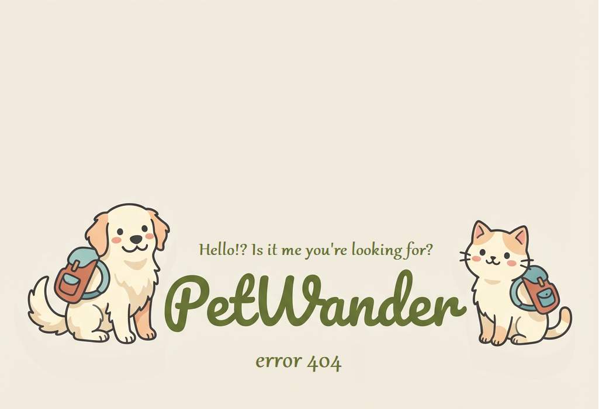

# 🚀 PetWander 404 Error Page - Deployment Guide

## 📦 What You Have

Two files:
1. **404.html** - Complete error page with navigation
2. **error404.png** - Adorable dog & cat illustration

---

## 🎯 How to Deploy

### **Option 1: React (Create React App)**

```bash
# 1. Copy files to public directory
your-app/
├── public/
│   ├── 404.html          ← Add this
│   └── error404.png      ← Add this
```

**Then update your hosting config:**

**For Vercel:**
Create `vercel.json` in project root:
```json
{
  "routes": [
    {
      "src": "/(.*)",
      "status": 404,
      "dest": "/404.html"
    }
  ]
}
```

**For Netlify:**
Create `netlify.toml` in project root:
```toml
[[redirects]]
  from = "/*"
  to = "/404.html"
  status = 404
```

---

### **Option 2: Next.js**

Next.js has built-in 404 support!

```bash
# Create 404 page component
your-app/
├── pages/
│   └── 404.js            ← Create this
└── public/
    └── error404.png      ← Add this
```

**Create `pages/404.js`:**
```javascript
export default function Custom404() {
  return (
    <div style={{ 
      textAlign: 'center', 
      padding: '40px',
      minHeight: '100vh',
      background: 'linear-gradient(135deg, #e3f2e3, #f5f1ec)',
      display: 'flex',
      alignItems: 'center',
      justifyContent: 'center'
    }}>
      <div style={{ maxWidth: '900px' }}>
        
        <div style={{
          background: 'white',
          borderRadius: '24px',
          padding: '48px',
          boxShadow: '0 8px 32px rgba(0,0,0,0.1)'
        }}>
          <h1>🐾 Oops! This Page is on an Adventure</h1>
          <p>This page wandered off without a map!</p>
          <a href="/" style={{
            display: 'inline-block',
            background: 'linear-gradient(135deg, #5a7c5a, #7a9b7a)',
            color: 'white',
            padding: '16px 48px',
            borderRadius: '16px',
            textDecoration: 'none',
            marginTop: '24px',
            fontWeight: 'bold'
          }}>
            🐕 Take Me Home
          </a>
        </div>
      </div>
    </div>
  );
}
```

---

### **Option 3: Static HTML / Apache**

```bash
# Upload files
your-website/
├── 404.html
└── error404.png
```

**Add to `.htaccess`:**
```apache
ErrorDocument 404 /404.html
```

---

### **Option 4: Nginx**

Add to your `nginx.conf`:
```nginx
error_page 404 /404.html;
location = /404.html {
    internal;
}
```

---

## ✅ Test Your 404 Page

After deploying, test by visiting:
- https://petwander.soulstormai.com/this-does-not-exist
- https://petwander.soulstormai.com/random-page-404
- https://petwander.soulstormai.com/asdfghjkl

**You should see:** Your adorable dog & cat 404 page! 🐕🐈

---

## 🎨 Customization Options

### **Update Navigation Links**

In `404.html`, change these URLs to match your routes:

```html
<!-- Current links -->
<a href="/" class="nav-card">Home</a>
<a href="/plan-trip" class="nav-card">Plan a Trip</a>
<a href="/destinations" class="nav-card">Destinations</a>
<a href="/my-trips" class="nav-card">My Trips</a>

<!-- Update to your actual routes -->
<a href="/" class="nav-card">Home</a>
<a href="/create-trip" class="nav-card">Create Trip</a>
<a href="/explore" class="nav-card">Explore</a>
<a href="/profile" class="nav-card">My Profile</a>
```

---

### **Add Your Logo**

Replace the 404 image with logo version:

```html
<!-- Add your logo above the error image -->
<div style="text-align: center; margin-bottom: 24px;">
  
</div>

```

---

### **Update Support Email**

Change the footer email:

```html
<!-- Current -->
<p class="footer-note">
  Lost? Email us at <strong>support@petwander.com</strong>
</p>

<!-- Update to your actual email -->
<p class="footer-note">
  Lost? Email us at <strong>help@petwander.com</strong>
</p>
```

---

## 📊 Track 404 Errors

The page already includes Google Analytics tracking!

**If GA4 is installed, it will automatically track:**
- 404 page views
- Which URLs resulted in 404s
- Referrer (where users came from)

**View in GA4:**
1. Go to Google Analytics
2. Events → page_view
3. Filter by page_title: "404 Error"
4. See which pages are causing 404s

---

## 🔧 Advanced: Custom 404 Redirects

**Redirect old URLs to new ones:**

In your hosting config (or use JavaScript in 404.html):

```javascript
// Add this to 404.html <script> section
const redirects = {
  '/old-page': '/new-page',
  '/blog/old-post': '/blog/new-post',
  '/pricing': '/premium'
};

const currentPath = window.location.pathname;
if (redirects[currentPath]) {
  window.location.href = redirects[currentPath];
}
```

---

## 💡 Why This 404 Page is Great

✅ **Brand Consistent** - Uses your dog + cat characters
✅ **Helpful Navigation** - Quick links to key pages
✅ **Search Included** - Users can search from 404
✅ **Analytics Tracked** - Monitor 404 errors
✅ **Mobile Responsive** - Looks great on all devices
✅ **Friendly Tone** - Keeps users engaged
✅ **SEO Friendly** - Has `noindex` meta tag (correct!)

---

## 🎯 Quick Deploy Checklist

For most hosting (Vercel, Netlify):

- [ ] Copy `404.html` to `/public/404.html`
- [ ] Copy `error404.png` to `/public/error404.png`
- [ ] Add hosting config (vercel.json or netlify.toml)
- [ ] Deploy to production
- [ ] Test by visiting: /test-404-page
- [ ] Verify image loads correctly
- [ ] Check navigation links work
- [ ] Confirm GA tracking works

---

## 🎊 Expected Result

When users hit a broken link, they'll see:

```
[Adorable Dog + Cat Image]

🐾 Oops! This Page is on an Adventure

Looks like this page wandered off without a map! 
Don't worry—our furry friends are here to help...

[Home] [Plan Trip] [Destinations] [My Trips]

[🐕 Take Me Home Button]

[Search Box]
```

**Much better than:** "404 - Not Found" 😊

---

## 🚀 Ready to Deploy?

1. Choose your deployment method (React, Next.js, etc.)
2. Copy both files to appropriate location
3. Add hosting config if needed
4. Deploy!
5. Test the 404 page
6. Celebrate! 🎉

---

## ❓ Need Help?

**Common Issues:**

**Q: 404 page not showing?**
A: Check hosting config (vercel.json or netlify.toml)

**Q: Image not loading?**
A: Verify `error404.png` is in `/public` directory

**Q: Links broken?**
A: Update href URLs to match your routes

**Q: Not working on Netlify?**
A: Add `netlify.toml` with redirect rule

**Q: Not working on Vercel?**
A: Add `vercel.json` with route config

---

Your adorable 404 page is ready to deploy! 🐕🐈✨
